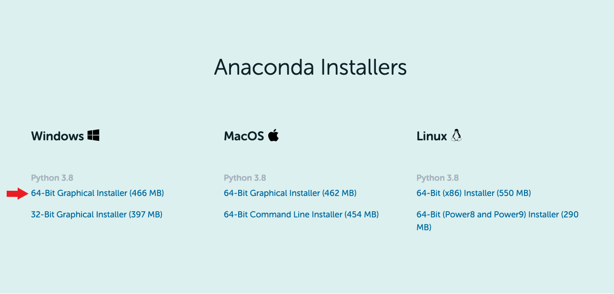
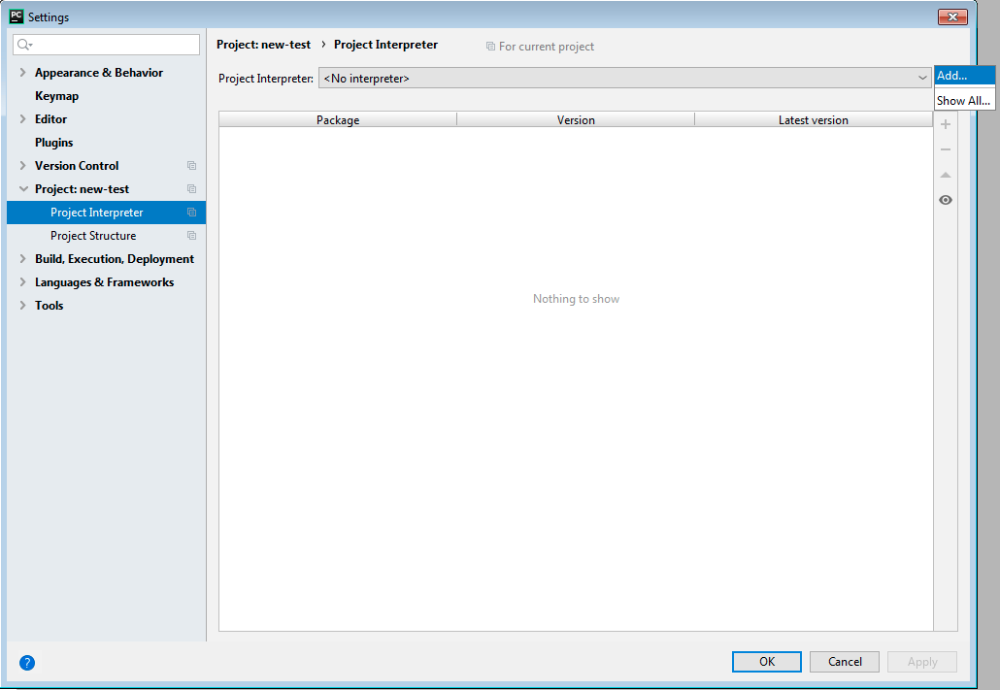
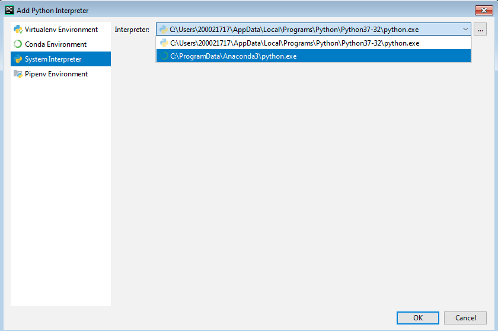
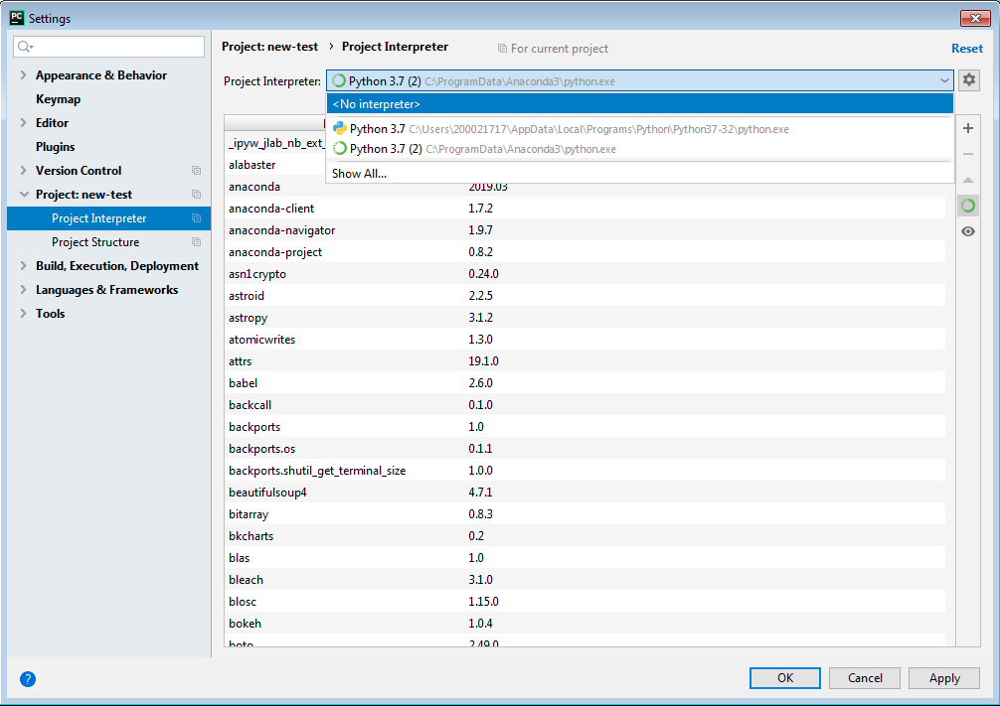
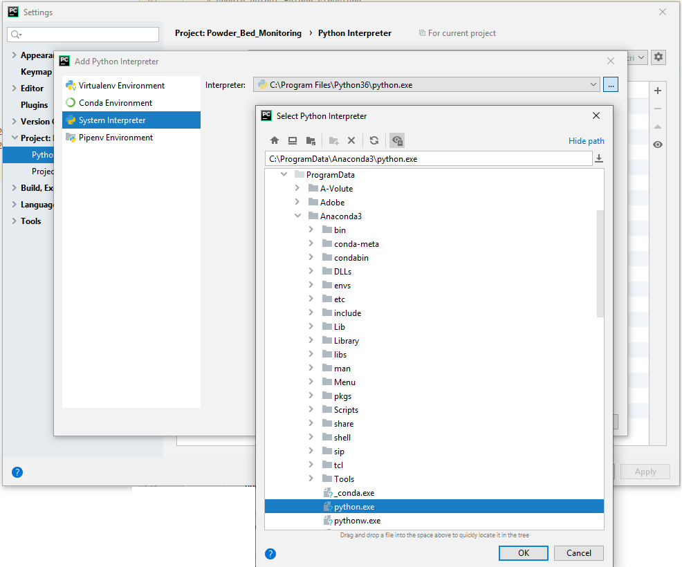

| [< Previous (Intro)](../README.md)  | [Day1](../README.md)| [Next (Session Objectives) >](SessionObjectives.md) |
|----|----|----|
# Environment Setup

On the first day, the class will setup a python environment on your laptop.

### Prerequisite Software

You will need a python environment, and IDE to participate in this course. Please download and install the following
before the course.

1. Download and install [Windows Anaconda 2020.07](https://repo.anaconda.com/archive/Anaconda3-2020.07-Windows-x86_64.exe)
or [MacOs Anaconda 2020.07](https://repo.anaconda.com/archive/Anaconda3-2020.07-MacOSX-x86_64.pkg)
2. Download and install [PyCharm Community Edition 2020.2.3](https://www.jetbrains.com/pycharm/download/)

### Further Notes

<u>Anaconda</u>

- In our classes, we shall use **Python 3.8**; hence download the Python 3.8 version of Anaconda
- Most of the laptops we use today are 64-bit machines. To confirm, checkout the instructions [here](https://support.microsoft.com/en-us/help/827218/how-to-determine-whether-a-computer-is-running-a-32-bit-version-or-64-bit-version-of-the-windows-operating-system)
- Your Anaconda download screen will (most probably) look like this. Download the 64-bit installer (pointed to by the red arrow)

### Configure a Python Interpreter for PyCharm

You can refer to this [link](https://www.jetbrains.com/help/pycharm/configuring-python-interpreter.html) 
to configure the Python interpreter. Or you can follow the instructions below.
- Once you install both PyCharm and Anaconda, open PyCharm and create a new project. Open `Settings...` 
under the menu `File`.

- Once in settings, click on `Project Interpreter` under `Project: [YOUR PROJECT NAME]` from the left.
Click the gear icon  and select `Add`.

- Select `System Interpreter` from the left menu, choose the Anaconda3 from the dropdown list, and the click `OK`.

- The Anaconda interpreter should be automatically populated under `Project Interpreter`. If not, select the 
Anaconda3 interpreter from the dropdown list. Click on `OK` to close the Settings menu, and now you should be all set.

- Sometimes, the Anaconda interpreter may not be automatically populated in the dropdown list. In this case, you will 
need to manually select it from the Anaconda installation directory.

| [< Previous (Intro)](../README.md) | [Day1](../README.md) | [Next (Session Objectives) >](SessionObjectives.md) |
| ---- | ---- | ---- |
